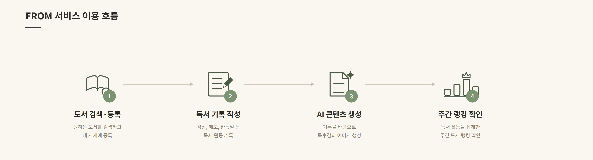
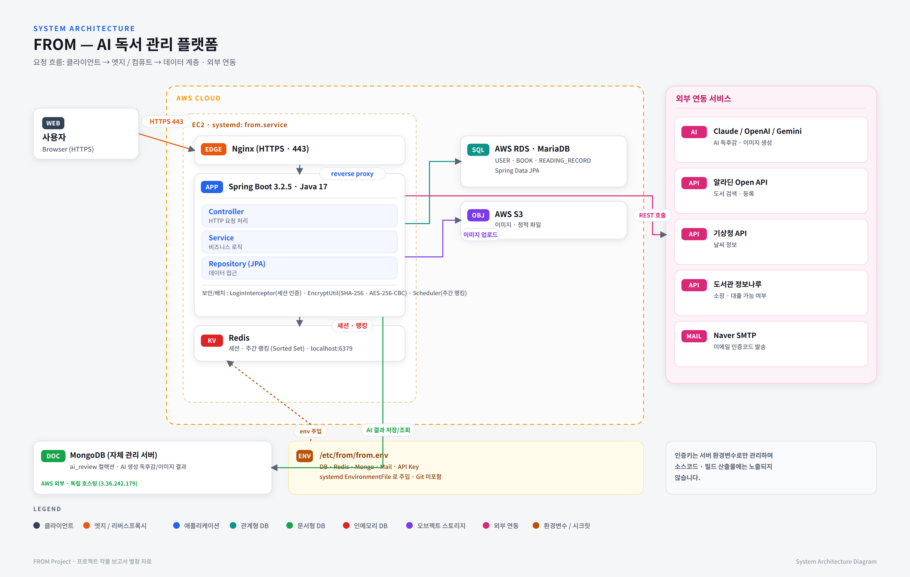
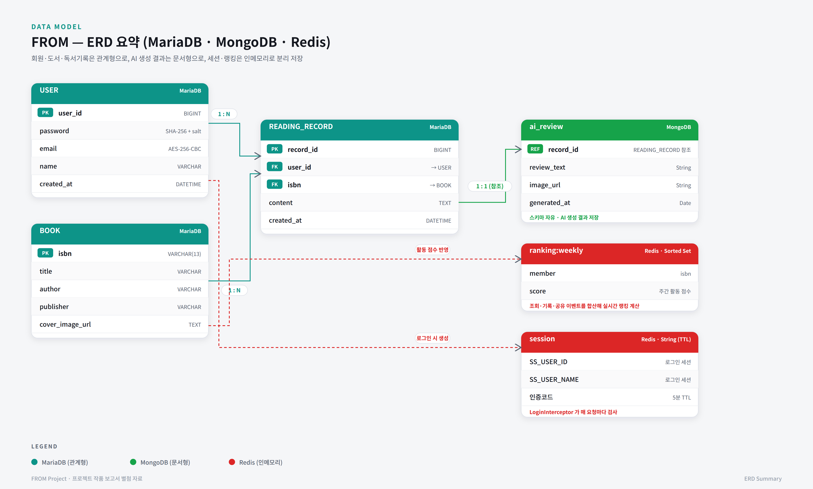

# FROM

> 지금의 나에게서 미래의 나에게 보내는 독서 편지

**FROM**은 책을 읽고 남긴 생각을 AI 독서 편지로 정리하고, 원하는 날짜에 이메일로 받아볼 수 있는 독서 기록 플랫폼입니다. 도서 검색과 나만의 서재, 책 속 주인공 이미지 생성, 맞춤 도서 추천과 독서 활동 공유를 하나의 서비스로 연결합니다.

## 주요 기능

| 기능 | 설명 |
| --- | --- |
| 회원 관리 | 이메일 인증 회원가입, 로그인·로그아웃, 아이디 찾기, 비밀번호 재설정, 프로필 관리 및 회원 탈퇴 |
| 도서 검색과 서재 | 알라딘 API 기반 도서 검색·베스트셀러 조회, 읽은 책 등록 및 기록 관리 |
| AI 독서 편지 | 책 정보와 강조할 내용, 문체를 바탕으로 미래의 나에게 보내는 편지 생성 |
| 이메일 예약 발송 | 지정한 날짜와 시각이 된 독서 편지를 스케줄러가 확인하여 이메일로 발송 |
| AI 이미지 생성 | 사용자 사진과 책 속 장면, 스타일을 바탕으로 이미지 생성·조회·다운로드 |
| 도서 추천 | 사용자 독서 정보에 기반한 AI 추천 및 주제별 추천 |
| 독서 커뮤니티 | 게시글 작성·조회·수정·삭제, 도서 평점과 감상, 좋아요·댓글, 사용자 팔로우 |
| 독서 통계와 랭킹 | 마이페이지 독서 활동 통계와 Redis 기반 주간 독서 랭킹 |
| 도서관 정보 | 도서관 정보나루 API 기반 도서관 검색, 인기 도서 및 도서 소장·대출 가능 여부 조회 |
| 날씨 정보 | 기상청 API를 활용한 날씨 예보 조회 |

위 내용은 현재 소스 코드에 구현된 기능을 기준으로 정리했습니다. 외부 서비스와 연결되는 기능은 해당 API 키와 인프라 설정이 필요합니다.

## 서비스 이용 흐름

1. 이메일 인증을 통해 가입한 뒤 로그인합니다.
2. 읽은 책을 검색하여 내 서재에 등록합니다.
3. 편지에 담을 내용과 문체, 편지지, 수신 날짜와 시각을 선택합니다.
4. AI가 생성한 독서 편지를 확인하고, 예약한 시점에 이메일로 받아봅니다.
5. 사진을 책 속 주인공 이미지로 만들거나, 독서 기록과 감상을 공유합니다.



## 기술 스택

| 구분 | 기술 |
| --- | --- |
| 언어·빌드 | Java 17, Gradle |
| 백엔드 | Spring Boot 3.2.5, Spring MVC, Spring WebClient, Lombok |
| 화면 | Thymeleaf, HTML, CSS, JavaScript |
| 관계형 데이터 | MariaDB, Spring Data JPA, JDBC |
| 문서 데이터 | MongoDB, Spring Data MongoDB |
| 세션·랭킹 | Redis, Spring Session Data Redis |
| 이메일 | Spring Mail, Naver SMTP |
| AI 연동 | OpenAI, Anthropic Claude, Google Gemini |
| 이미지 저장 | Amazon S3 |
| 배포 | AWS EC2, systemd |
| 테스트 | JUnit 5, Spring Boot Test |

## 구조와 설계

요청은 `Controller → Service → Repository` 계층으로 처리합니다. 외부 이미지 생성 API 호출은 별도의 `client` 패키지로 분리하고, 예약 작업은 `scheduler`에서 수행합니다.

- **MariaDB**: 회원, 도서, 독서 기록, 게시글, 평점, 팔로우 및 이미지 메타데이터를 저장합니다.
- **MongoDB**: 생성된 독서 편지 본문과 예약 발송 정보를 저장합니다.
- **Redis**: 로그인 세션을 관리하고, Sorted Set으로 주간 독서 랭킹을 처리합니다.
- **Amazon S3**: 업로드한 원본 사진과 생성된 이미지 파일을 저장합니다.

### AI 처리 흐름

- **독서 편지**: 책 정보·강조할 내용·문체 → OpenAI → MongoDB 저장 → 예약 시점에 이메일 발송
- **주인공 이미지**: 사용자 사진·책·장면·스타일 → Claude 프롬프트 생성 → Gemini 이미지 생성 → S3 저장

### 시스템 구성도



### ERD



### 디렉터리 구조

```text
src/main/
├── java/com/from/
│   ├── client/                 # Claude·Gemini API 클라이언트
│   ├── config/                 # DB, Redis 관련 웹 세션 설정, S3, 암호화 등
│   ├── constant/               # 지역 코드 등 상수
│   ├── controller/             # HTTP 요청 및 화면 처리
│   ├── dto/                    # 요청·응답 데이터
│   ├── interceptor/            # 로그인 접근 제어
│   ├── repository/
│   │   ├── entity/             # JPA 엔티티
│   │   └── document/           # MongoDB 문서
│   ├── scheduler/              # 편지 예약 발송·랭킹 동기화
│   ├── service/                # 서비스 인터페이스
│   │   └── impl/               # 비즈니스 로직
│   └── util/                   # 공통 유틸리티
└── resources/
    ├── static/                 # CSS·이미지
    ├── templates/              # 기능별 Thymeleaf 화면
    └── application.properties  # 애플리케이션 설정
```

## 실행 방법

### 1. 사전 준비

- JDK 17
- MariaDB, MongoDB, Redis
- Naver SMTP 계정 및 사용할 외부 API의 인증 정보
- 이미지 업로드에 사용할 S3 버킷과 접근 권한

Gradle Wrapper가 포함되어 있어 Gradle을 별도로 설치할 필요는 없습니다.

### 2. 환경 설정

프로젝트 루트의 `.env` 파일 또는 실행 환경의 환경 변수에 아래 값을 설정합니다. 로컬에서는 `spring-dotenv`가 `.env`를 읽으며, `.env`는 Git에서 제외됩니다.

| 용도 | 환경 변수 |
| --- | --- |
| MariaDB | `DB_USERNAME`, `DB_PASSWORD` |
| MongoDB | `MONGO_USERNAME`, `MONGO_PASSWORD` |
| Redis | `REDIS_PASSWORD` |
| 이메일 | `MAIL_USERNAME`, `MAIL_PASSWORD` |
| 도서·도서관·날씨 API | `ALADIN_API_KEY`, `LIBRARY_API_KEY`, `WEATHER_API_KEY` |
| AI API | `OPENAI_API_KEY`, `ANTHROPIC_API_KEY`, `GEMINI_API_KEY` |
| AWS | `AWS_ACCESS_KEY`, `AWS_SECRET_KEY` |
| 이메일 암호화 | `ENCRYPT_AES_KEY`, `ENCRYPT_AES_IV` |
| Kakao 설정 | `KAKAO_CLIENT_ID`, `KAKAO_CLIENT_SECRET` |

Kakao 항목은 설정 파일에 남아 있는 값이며, 이 README에서는 소셜 로그인을 제공 기능으로 안내하지 않습니다. AES 키와 IV는 현재 구현에서 요구하는 각각 16바이트 문자열로 설정합니다.

실제 비밀번호와 API 키는 저장소에 커밋하지 않습니다. `application.properties`의 인증 정보는 `${환경변수명}` 형식을 유지합니다.

실행 전에 다음 항목도 자신의 환경에 맞춰 확인합니다.

- DB 접속 주소, Redis 주소, MongoDB URI와 인증 DB
- S3 버킷 이름과 리전, 메일 서버 설정
- **MariaDB 스키마**: `spring.jpa.hibernate.ddl-auto=validate`이므로 테이블이 자동 생성되지 않습니다. 엔티티에 맞는 스키마를 미리 준비해야 합니다.
- **MongoDB 데이터베이스**: 현재 `MongoConfig`의 `MongoTemplate`은 `fromdb`를 사용합니다. URI의 DB명과 별도로 이 설정과 계정 권한을 확인해야 합니다.

### 3. 애플리케이션 실행

macOS / Linux:

```bash
./gradlew bootRun
```

Windows PowerShell:

```powershell
.\gradlew.bat bootRun
```

실행 후 [http://localhost:11000](http://localhost:11000)에 접속합니다.

### 4. 테스트 및 빌드

```bash
# 전체 테스트
./gradlew test

# 테스트를 포함한 빌드
./gradlew build

# 배포용 실행 JAR 생성 (테스트 태스크 제외)
./gradlew clean bootJar
```

Windows에서는 `./gradlew` 대신 `.\gradlew.bat`를 사용합니다. 애플리케이션 컨텍스트를 로드하는 테스트에는 환경 변수와 외부 서비스 연결이 필요합니다.

생성 파일: `build/libs/From-0.0.1-SNAPSHOT.jar`

## 배포 시 설정 관리

운영 환경에서는 systemd 서비스가 `/etc/from/from.env`를 `EnvironmentFile`로 읽어 인증 정보를 주입합니다. 환경 파일은 저장소에 포함하지 않고 접근 권한을 제한합니다.

배포 JAR에는 실제 인증 정보를 넣지 않으며, 배포 전에 다음 명령으로 설정 파일의 환경 변수 플레이스홀더가 남아 있는지 확인합니다.

```bash
unzip -p build/libs/From-0.0.1-SNAPSHOT.jar BOOT-INF/classes/application.properties | grep -c '\${'
```

결과가 `0`이면 배포를 중단하고 빌드 설정을 확인합니다. 이 검사는 플레이스홀더 보존 여부를 확인하기 위한 검사입니다.

## 관련 자료

- [서비스 이용 흐름](docs/FROM_서비스이용흐름.png)
- [시스템 아키텍처](docs/FROM_시스템아키텍처.png)
- [ERD](docs/FROM_ERD.png)
